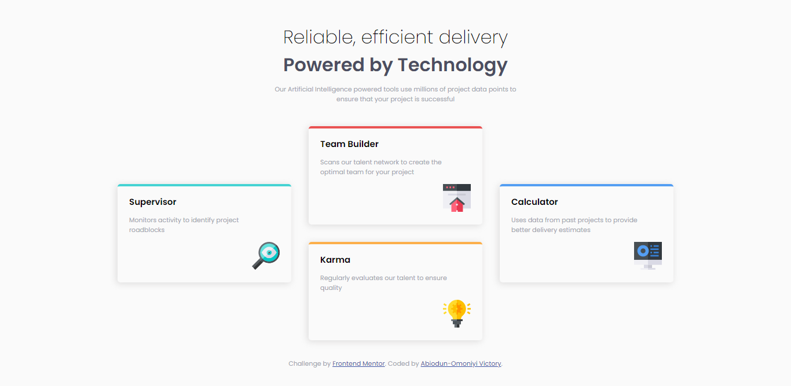

# Frontend Mentor - Four card feature section solution

This is a solution to the [Four card feature section challenge on Frontend Mentor](https://www.frontendmentor.io/challenges/four-card-feature-section-weK1eFYK). Frontend Mentor challenges help you improve your coding skills by building realistic projects. 

## Table of contents

- [Overview](#overview)
  - [The challenge](#the-challenge)
  - [Screenshot](#screenshot)
  - [Links](#links)
- [My process](#my-process)
  - [Built with](#built-with)
  - [What I learned](#what-i-learned)
  - [Useful resources](#useful-resources)
- [Author](#author)


## Overview

### The challenge

Users should be able to:

- View the optimal layout for the site depending on their device's screen size

### Screenshot




### Links

- Solution URL: [Add solution URL here](https://github.com/preciousvictory/Four-card-feature-section-master--Frontend-mentor/)
- Live Site URL: [Add live site URL here](https://preciousvictory.github.io/Four-card-feature-section-master--Frontend-mentor/)

## My process

### Built with

- Semantic HTML5 markup
- CSS custom properties
- Flexbox

### What I learned

- Left and right align using float. I used this to align the pictures in each card to be aligned to the right.
```css
.card .img{
    float: right;
}
```

- Wnen the element is taller than the element containing it, and it is floated, it will overflow outside of its container. I used the following so that all other containerss are in the element 
```css
.card::after {
  content: "";
  clear: both;
  display: table;
}
```

### Useful resources

- [Example resource 1](https://www.w3schools.com/css/css_align.asp) - This helped me learn how to prevent overflow when i used float: right;

## Author

- Website - [Add your name here](https://www.your-site.com)
- Frontend Mentor - [@yourusername](https://www.frontendmentor.io/profile/preciousvictory)
- Twitter - [@yourusername](https://www.twitter.com/preciousvicky_)
